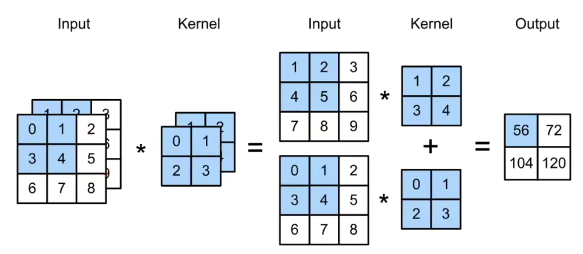

# 1. Concept
Applying 'translation invariance' and 'locality' to the MLP, we then get a CNN which can significantly reduce the parameters.

$$h_{i,j} = \sum_{a,b}v_{i,j,a,b}x_{i+a,j+b}$$

$$\Rightarrow h_{i,j} = \sum_{a=-\Delta}^{\Delta}\sum_{b=-\Delta}^{\Delta}v_{a,b}x_{i+a,j+b}$$

# 2. Conv2d
## 2.1 Definition
Input $$X: (N, C_{in}, H, W)$$

Kernel $$W: (h,w)$$

Bias: $$b$$

Output $$Y: (N, C_{out}, H', W')$$

$$Y=X\star W+b$$

## 2.2 Cross Correlation

$$y_{i,j} = \sum_{a=1}^{h}\sum_{b=1}^{w}w_{a,b}x_{i+a,j+b}$$

## 2.3 Conv2d

$$y_{i,j} = \sum_{a=1}^{h}\sum_{b=1}^{w}w_{-a,-b}x_{i+a,j+b}$$

As for implementation, we use 'Cross Correlation' but call it 'Conv2d'.

## 2.4 Conv1d && Conv3d
text, language, time sequences.

$$y_{i} = \sum_{a=1}^{h}w_{a}x_{i+a}$$

videos, medical images, meteorology.

$$y_{i, j, k} = \sum_{a=1}^{h}\sum_{b=1}^{w}\sum_{c=1}^{d}w_{a,b,c}x_{i+a,j+b,k+c}$$

inception v1...

# 3. Padding

While using Conv2d, we usually get smaller features. In order to keep the shape constant, we fill 0s at the edge.

Output Shape: $$(H, W) => (H-h+p_h+1,W-w+p_w+1)$$

Normally we choose $$p_h = h-1, p_w = w-1$$, then the shape doesn't change. 

If h is odd, then padding $$\frac{p_h}{2}$$ on both sides, otherwise, we padding $$\lfloor \frac{p_h}{2} \rfloor$$ and $$\lceil \frac{p_h}{2} \rceil$$.

# 4. Stride

While using Conv2d, sometimes we hope to decrease the shape faster. What we can do is to increase the stride of each move.

Output Shape: $$(H, W) => (\lfloor\frac{H-h+p_h+s_h}{s_h}\rfloor,\lfloor\frac{W-w+p_w+s_w}{s_w}\rfloor)$$

If $$p_h = h-1, p_w = w-1$$, and we know that $$\frac{s_h-1}{s_h}<1$$, then the output is $$(\lfloor\frac{H}{s_h}\rfloor,\lfloor\frac{W}{s_w}\rfloor)$$

the essence of ml is compression!

# 5. Channel

Each channel has a corresponding kernel, and the result is the sum of them.

## 5.1 Input channel

input: $$X: C_{in},H,W$$

kernel: $$W: C_{in},h,w$$

output: $$Y: H',W'$$

$$Y=\sum_{i=0}^{C_{in}}X_{i,:,:}\star W_{i,:,:}$$

## 5.2 Output channel

input: $$X: C_{in},H,W$$

kernel: $$W: C_{out},C_{in},h,w$$

output: $$Y: C_{out},H',W'$$

## 5.3 1x1 Kernel

It's equivalent to a Full Connected Layer, and each kernel fuse channels by sharing parameters. No space pattern.

## 5.4 Complexity

$$O(C_{in}C_{out}hwH'W')$$

'padding 0' only add a constant to the result.

# 6. Pooling Layer

Edge detecton [1, -1] is position sensitive. So 'Pooling Layer' add transform invariance which return the maximum(average) of the sliding window.

# 6.1 features

* hyperparameter: size, padding, stride(=size by default)
* no learning parameter
* input channel + pooling layer => output channel
* output channel = input channel (no channel fuse)

# 6.2 QA

The 'data transform' play down its role.