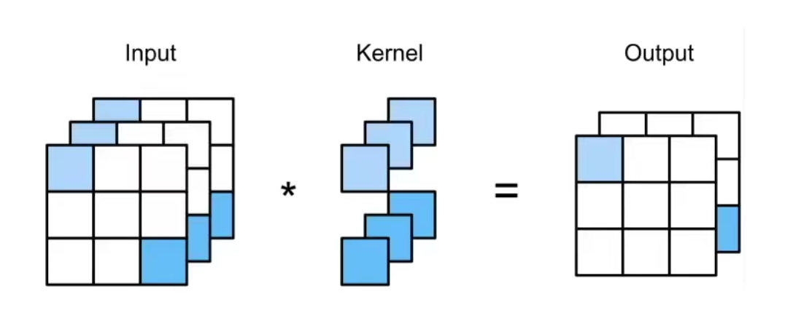

# 1. NiN block
Since 'Dense Layer' has so many parameters, we replace them by '1x1 Conv'. The shape doesn't change while using '1x1 Conv'.

* Conv2d    (the same as AlexNet, ReLu)
* 1x1 Conv, stride 1, no pad    (out_channel = in_channel, ReLU)
* 1x1 Conv, stride 1, no pad    (out_channel = in_channel, ReLU)

# 2. Architecture
NiN's architecture is based on AlexNet, but we don't use 'Dense Layer'.
* NiN block
* 3x3 MaxPool, stride 2 (half size)
* ...
* Dropout(0.5)
* NiN block
* Global AvgPool (Flatten)
* Softmax (classification)

# 3. Q&A
* AvgPool decrease the dimension((m, n) => (1, 1)) and has no training parameters, so it tends to have good generalization ability. 
* In the meanwhile, it costs more time on training.